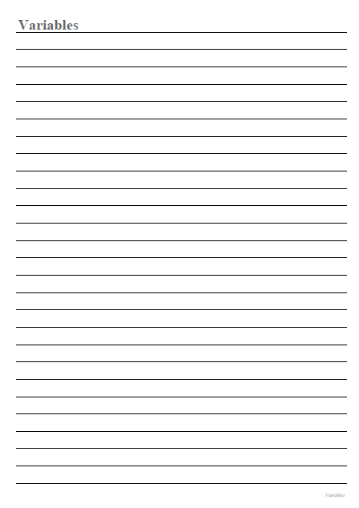

# Generate PDF Documents with Python

## Project Description

**Overview :**  
The PDF Document Generator for Python Study Notes is a tool designed to simplify the process of creating and organizing study materials for someone learning Python.

**Challenges :**  
Build The PDF Document Generator that allows users for taking notes.

## Project Goal

The project aims to automate the generation of PDF documents containing comprehensive python study notes.

## Tools & Library Used

 &nbsp;

## Project Result

[Click here to get full code](https://github.com/nickenshidqia/Generate_PDF_Documents_With_Python/blob/1b45e47ec370964a5697728f42057ae60d2e4f9a/main.py)  
[Click here to get PDF file](https://github.com/nickenshidqia/Generate_PDF_Documents_With_Python/blob/1b45e47ec370964a5697728f42057ae60d2e4f9a/output.pdf)

### Generate PDF Documents with Python

